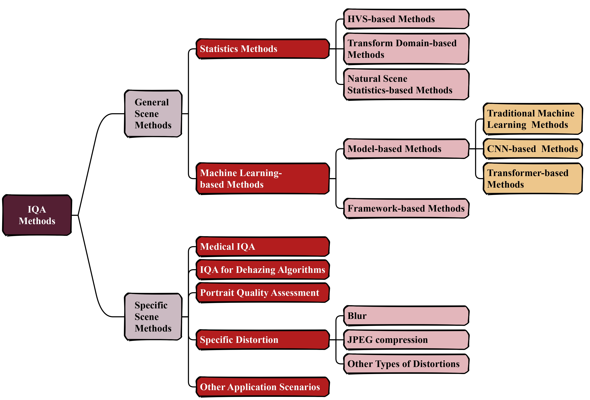

# A Survey on IQA: Insights, Analysis, and Future Outlook



## 🔍 Introduction

Image Quality Assessment (IQA) is a critical component of image-related technologies and plays a pivotal role in the advancement of image processing and computer vision. In recent years, the proliferation of novel training frameworks and machine learning models has given rise to a multitude of IQA methodologies. This survey conducts a comprehensive review of nearly 200 IQA-related publications, synthesizing key developments in the field and systematically categorizing existing approaches based on their underlying models, training frameworks, publication timelines, application scenarios, and academic impact. This structured analysis aims to facilitate a swift introduction for newcomers while providing seasoned researchers with a clearer perspective on the current state of the field. Moreover, we offer a critical evaluation of the advantages and limitations of various IQA methods and present our perspectives on future research directions. To complement the survey, this repository compiles both the IQA techniques discussed in the paper and other approaches that could not be included due to space constraints, thereby serving as a valuable resource to support further advancements in IQA research.<br>

图像质量评估（IQA）在图像相关的技术中起着非常重要的作用，对于图像处理和计算机视觉领域的技术发展有着深远的影响。近年来，随着新型训练框架和机器学习模型的出现，许多IQA方法涌现出来。本综述通过调研接近二百篇IQA相关论文，总结了IQA发展中值得关注的工作，并按照不同方法所用的模型、训练框架、发表时间、使用场景和影响力进行了整理，以方便初学者快速入门、资深研究者更好地了解领域发展现状。随后，我们对诸多IQA方法的优缺点进行了分析，对IQA方法的未来发展提出了自己的见解。本repository旨在列出论文中提到的、以及受篇幅限制未提到的经典IQA方法，配合论文阅读，以促进IQA技术的发展。

🚀English Paper link: [A Survey on Image Quality Assessment: Insights, Analysis, and Future Outlook](https://arxiv.org/abs/2502.08540)<br>
🚀Chinese Paper link: [在计算机视觉领域中，我们应该如何评估图像质量（万字长文）？](https://zhuanlan.zhihu.com/p/25680975953)

## Update Records

- 🔥 [March.2,2025] The chinese version of our survey has been released on zhihu.
- 🔥 [Feb.12,2025] The first version of our survey has been released on arXiv.

## 📜 Table of Contents

- [📚 Image Quality Assessment Methods](#-Image-Quality-Assessment-Methods)
  - 📗 General Scene Methods
    - 📕 Statistics Methods
      - 📘 [HVS-based Methods](#1)
      - 📘 [Transform Domain-based Methods](#2)
      - 📘 [Natural Scene Statistics-based Methods](#3)
    - 📕 Machine Learning-based Methods
      - 📘 Model-based Methods
        - 📙 [Traditional Machine Learning Methods](#4)
        - 📙 [CNN-based Methods](#5)
        - 📙 [Transformer-based Methods](#6)
      - 📘 [Framework-based Methods](#7)

  - 📗 Specific Scene Methods
    - 📕 [Medical IQA](#8)
    - 📕 [IQA for Dehazing Algorithms](#9)
    - 📕 [Portrait Quality Assessment](#10)
    - 📕 [Specific Distortion](#12)
      - 📙 Blue
      - 📙 JPEG compression

[👨‍💻 Contributers](#-Contributers)
 - Zhengyi Shi@[11xiaoyi11](https://github.com/11xiaoyi11)
 - Chengqian Ma@[step-out](https://github.com/step-out) 
 - Weixuan Jin@[axax11344](https://github.com/axax11344) 

[✒️ Citation](#-Citation)

- If you find this survey useful, please consider citing it.

[📧 Contact Us](#-Contact-Us)

## 📚 Image Quality Assessment Methods


<table>
    <tr>
        <td>Metrics</td>
        <td>Citation number as of Feb.1,2025.</td>
        <td>Earliest publication time</td>
        <td>With/Without reference</td>
        <td>Paper name</td>
    </tr>
    <tr>
        <td colspan="5" align="center"><a id="1"></a> 📖HVS-Based Method</td>
    </tr>
    <tr>
        <td>signal-to-noise ratio (SNR)</td>
        <td></td>
        <td></td>
        <td>With</td>
        <td></td>
    </tr>
    <tr>
        <td>peak SNR (PSNR)</td>
        <td></td>
        <td></td>
        <td>With</td>
        <td></td>
    </tr>
    <tr>
        <td>mean squared error (MSE)</td>
        <td></td>
        <td></td>
        <td>With</td>
        <td></td>
    </tr>
    <tr>
        <td>structural similarity (SSIM)</td>
        <td>58352</td>
        <td>2004.04</td>
        <td>With</td>
        <td>
          <a href="https://ieeexplore.ieee.org/document/1284395">Image quality assessment: From error visibility to structural similarity</a>
        </td>
    </tr>
    <tr>
        <td>multi-scale SSIM (MS-SSIM)</td>
        <td>8043</td>
        <td>2004.05</td>
        <td>With</td>
        <td><a href="https://ieeexplore.ieee.org/document/1292216">Multiscale structural similarity for image quality assessment</a></td>
    </tr>
    <tr>
        <td>universal image quality index (UQI)</td>
        <td>7419</td>
        <td>2002.03</td>
        <td>With</td>
        <td><a href="https://ieeexplore.ieee.org/document/995823">A universal image quality index</a></td>
    </tr>
    <tr>
        <td>feature similarity index (FSIM)</td>
        <td>5512</td>
        <td>2011.01</td>
        <td>With</td>
        <td><a href="https://ieeexplore.ieee.org/document/5705575">FSIM: A feature similarity index for image quality assessment</a></td>
    </tr>
    <tr>
        <td>Visual information fidelity (VIF)</td>
        <td>4861</td>
        <td>2006.02</td>
        <td>With</td>
        <td><a href="https://ieeexplore.ieee.org/abstract/document/1576816">Image information and visual quality</a></td>
    </tr>
    <tr>
        <td>Most Apparent Distortion (MAD)</td>
        <td>2250</td>
        <td>2010.01</td>
        <td>With</td>
        <td><a href="https://s2.smu.edu/~eclarson/pubs/2010JEI_MAD.pdf">Most apparent distortion: Full-reference image quality assessment and the role of strategy</a></td>
    </tr>
    <tr>
        <td>Gradient Magnitude Similarity Deviation (GMSD)</td>
        <td>1716</td>
        <td>2013.12</td>
        <td>With</td>
        <td><a href="https://arxiv.org/abs/1308.3052">Gradient magnitude similarity deviation: A highly efficient perceptual image quality index</a></td>
    </tr>
    <tr>
        <td>Visual SNR (VSNR)</td>
        <td>1578</td>
        <td>2007.08</td>
        <td>With</td>
        <td><a href="https://ieeexplore.ieee.org/document/4286985">VSNR: A wavelet-based visual signal-to-noise ratio for natural images</a></td>
    </tr>
    <tr>
        <td>Information content Weighted SSIM (IW-SSIM)</td>
        <td>1533</td>
        <td>2010.11</td>
        <td>With</td>
        <td><a href="https://ieeexplore.ieee.org/document/5635337">Information content weighting for perceptual image quality assessment</a></td>
    </tr>
    <tr>
        <td></td>
        <td>1319</td>
        <td>2002.05</td>
        <td>With</td>
        <td><a href="https://ieeexplore.ieee.org/abstract/document/5745362">Why is image quality assessment so difficult?</a></td>
    </tr>
    <tr>
        <td>Visual Saliency-induced Index(VSI)</td>
        <td>1082</td>
        <td>2014.08</td>
        <td>With</td>
        <td><a href="https://ieeexplore.ieee.org/document/6873260">VSI: A visual saliency-induced index for perceptual image quality assessment</a></td>
    </tr>
    <tr>
        <td>GSIM</td>
        <td>872</td>
        <td>2011.11</td>
        <td>With</td>
        <td><a href="https://ieeexplore.ieee.org/abstract/document/6081939">Image quality assessment based on gradient similarity</a></td>
    </tr>
    <tr>
        <td>complex wavelets-SSIM (CW-SSIM)</td>
        <td>455</td>
        <td>2005.05</td>
        <td>With</td>
        <td><a href="https://ieeexplore.ieee.org/document/1415469">Translation insensitive image similarity in complex wavelet domain</a></td>
    </tr>
    <tr>
        <td>HVS-based peak SNR (PSNR-HVS)</td>
        <td>433</td>
        <td>2006.01</td>
        <td>With</td>
        <td><a href="https://www.researchgate.net/publication/251229783_A_NEW_FULL-REFERENCE_QUALITY_METRICS_BASED_ON_HVS">A new full-reference quality metrics based on HVS</a></td>
    </tr>
    <tr>
        <td>RR-SSIM</td>
        <td>320</td>
        <td>2012.08</td>
        <td>With</td>
        <td><a href="https://ieeexplore.ieee.org/document/6193206">Reduced-reference image quality assessment by structural similarity estimation</a></td>
    </tr>
    <tr>
        <td>PSIM</td>
        <td>238</td>
        <td>2017.05</td>
        <td>With</td>
        <td><a href="https://ieeexplore.ieee.org/abstract/document/7815393">A fast reliable image quality predictor by fusing micro- and macro-structures</a></td>
    </tr>
    <tr>
        <td colspan="5" align="center"><a id="2"></a> 📖Transform Domain-Based Method</td>
    </tr>
    <tr>
        <td>BLIINDS-II</td>
        <td>1912</td>
        <td>2012.03</td>
        <td>Without</td>
        <td><a href="https://ieeexplore.ieee.org/document/6172573">Blind image quality assessment: A natural scene statistics approach in the DCT domain</a></td>
    </tr>
    <tr>
        <td></td>
        <td>600</td>
        <td>2005.03</td>
        <td>With</td>
        <td><a href="https://www.semanticscholar.org/paper/Reduced-reference-image-quality-assessment-using-a-Wang-Simoncelli/7fabaa7282d758159611eeac373a3374dbd855dc">Reduced-reference image quality assessment using a wavelet-domain natural image statistic model</a></td>
    </tr>
    <tr>
        <td></td>
        <td>482</td>
        <td>2006.02</td>
        <td></td>
        <td><a href="https://ieeexplore.ieee.org/document/1576815">An SVD-based grayscale image quality measure for local and global assessment</a></td>
    </tr>
    <tr>
        <td>SFF</td>
        <td>180</td>
        <td>2013.06</td>
        <td>With</td>
        <td><a href="https://ieeexplore.ieee.org/document/6525380">Sparse feature fidelity for perceptual image quality assessment</a></td>
    </tr>
    <tr>
        <td></td>
        <td>55</td>
        <td>2015.07</td>
        <td>With</td>
        <td><a href="https://www.sciencedirect.com/science/article/pii/S0925231215001253">Image quality assessment: a sparse learning way</a></td>
    </tr>
    <tr>
        <td>QASD</td>
        <td>50</td>
        <td>2016.06</td>
        <td>With</td>
        <td><a href="https://ieeexplore.ieee.org/document/7486021#:~:text=In%20this%20paper%2C%20a%20new%20sparse%20representation-based%20image,proposed%20based%20on%20the%20construction%20of%20adaptive%20sub-dictionaries.">Sparse representation-based image quality index with adaptive sub-dictionaries</a></td>
    </tr>
    <tr>
        <td></td>
        <td>50</td>
        <td>2017.11</td>
        <td>With</td>
        <td><a href="https://ieeexplore.ieee.org/document/8101526">From sparse coding significance to perceptual quality: a new approach for image quality assessment</a></td>
    </tr>
    <tr>
        <td colspan="5" align="center"><a id="3"></a> 📖NSS-Based Method</td>
    </p></tr>
    <tr>
        <td></td>
        <td>3526</td>
        <td>2006.10</td>
        <td></td>
        <td><a href="https://ieeexplore.ieee.org/document/1709988">A statistical evaluation of recent full reference image quality assessment algorithms</a></td>
    </tr>
    <tr>
        <td>IFC</td>
        <td>1721</td>
        <td>2005.11</td>
        <td>With</td>
        <td><a href="https://ieeexplore.ieee.org/document/1532311">An information fidelity criterion for image quality assessment using natural scene statistics</a></td>
    </tr>
    <tr>
        <td>Tone-Mapped images Quality Index (TMQI)</td>
        <td>720</td>
        <td>2012.10</td>
        <td>With</td>
        <td><a href="https://ieeexplore.ieee.org/document/6319406">Objective quality assessment of tone-mapped images</a></td>
    </tr>
    <tr>
        <td></td>
        <td>397</td>
        <td>2007.09</td>
        <td></td>
        <td><a href="https://www.researchgate.net/publication/5788132_Blind_image_quality_assessment_through_anisotropy">Blind image quality assessment through anisotropy</a></td>
    </tr>
    <tr>
        <td>Dynamic Range Independent quality Measure (DRIM)</td>
        <td>371</td>
        <td>2008.08</td>
        <td>With</td>
        <td><a href="https://www.cl.cam.ac.uk/~rkm38/pdfs/aydin08driiqa.pdf">Dynamic range independent image quality assessment</a></td>
    </tr>
    <tr>
        <td colspan="5" align="center"><a id="4"></a> 📖Traditional Machine Learning Method</td>
    </tr>
    <tr>
        <td>BRISQUE</td>
        <td>5733</td>
        <td>2012.08</td>
        <td>Without</td>
        <td><a href="https://ieeexplore.ieee.org/document/6272356">No-reference image quality assessment in the spatial domain</a></td>
    </tr>
    <tr>
        <td>DIIVINE</td>
        <td>2003</td>
        <td>2011.01</td>
        <td>Without</td>
        <td><a href="https://ieeexplore.ieee.org/abstract/document/5756237">Blind image quality assessment: From natural scene statistics to perceptual quality</a></td>
    </tr>
    <tr>
        <td>IL-NIQE</td>
        <td>1214</td>
        <td>2015.04</td>
        <td>Without</td>
        <td><a href="https://ieeexplore.ieee.org/document/7094273">A feature-enriched completely blind image quality evaluator</a></td>
    </tr>
    <tr>
        <td></td>
        <td>292</td>
        <td>2009.03</td>
        <td>Without</td>
        <td><a href="https://www.sciencedirect.com/science/article/pii/S1568494608001075">No-reference image quality assessment using modified extreme learning machine classifier</a></td>
    </tr>
    <tr>
        <td>Multi-Method Fusion (MMF)</td>
        <td>216</td>
        <td>2012.12</td>
        <td>With</td>
        <td><a href="https://ieeexplore.ieee.org/abstract/document/6392947">Image quality assessment using multi-method fusion</a></td>
    </tr>
    <tr>
        <td></td>
        <td>200</td>
        <td>2010.01</td>
        <td></td>
        <td><a href="https://ieeexplore.ieee.org/document/5395628">Objective image quality assessment based on support vector regression</a></td>
    </tr>
    <tr>
        <td>SVDR</td>
        <td>184</td>
        <td>2011.09</td>
        <td>With</td>
        <td><a href="https://ieeexplore.ieee.org/document/6031933">SVD-based quality metric for image and video using machine learning</a></td>
    </tr>
    <tr>
        <td></td>
        <td>176</td>
        <td>2015.03</td>
        <td>Without</td>
        <td><a href="https://ieeexplore.ieee.org/abstract/document/7060692">Blind Image Quality Assessment Based on Multichannel Feature Fusion and Label Transfer</a></td>
    </tr>
    <tr>
        <td>ParaBoost</td>
        <td>86</td>
        <td>2015.12</td>
        <td>With</td>
        <td><a href="https://ieeexplore.ieee.org/document/7358139">A paraboost method to image quality assessment</a></td>
    </tr>
    <tr>
        <td colspan="5" align="center"><a id="5"></a> 📖CNN-Based Method</td>
    </tr>
    <tr>
        <td></td>
        <td>12353</td>
        <td>2018.01</td>
        <td></td>
        <td><a href="https://arxiv.org/abs/1801.03924">The Unreasonable Effectiveness of Deep Features as a Perceptual Metric</a></td>
    </tr>
    <tr>
        <td>IQA-CNN</td>
        <td>1406</td>
        <td>2014.09</td>
        <td>Without</td>
        <td><a href="https://ieeexplore.ieee.org/document/6909620">Convolutional neural networks for no-reference image quality assessment</a></td>
    </tr>
    <tr>
        <td></td>
        <td>1229</td>
        <td>2017.10</td>
        <td>FR+NR</td>
        <td><a href="https://ieeexplore.ieee.org/document/8063957">Deep neural networks for no-reference and full-reference image quality assessment</a></td>
    </tr>
    <tr>
        <td>DISTS</td>
        <td>847</td>
        <td>2020.12</td>
        <td>With</td>
        <td><a href="https://ieeexplore.ieee.org/document/9298952">Image Quality Assessment: Unifying Structure and Texture Similarity</a></td>
    </tr>
    <tr>
        <td>BIQA by a Self-Adaptive<br>Hyper Network</td>
        <td>667</td>
        <td>2020.06</td>
        <td>Without</td>
        <td><a href="https://ieeexplore.ieee.org/document/9156687">Blindly Assess Image Quality in the Wild Guided by a Self-Adaptive Hyper Network</a></td>
    </tr>
    <tr>
        <td>MEON</td>
        <td>593</td>
        <td>2017.11</td>
        <td></td>
        <td><a href="https://ieeexplore.ieee.org/document/8110690">End-to-end blind image quality assessment using deep neural networks</a></td>
    </tr>
    <tr>
        <td>RankIQA</td>
        <td>556</td>
        <td>2017.07</td>
        <td>Without</td>
        <td><a href="https://ieeexplore.ieee.org/document/8237380">RankIQA: Learning from rankings for no-reference image quality assessment</a></td>
    </tr>
    <tr>
        <td>BIECON</td>
        <td>487</td>
        <td>2016.12</td>
        <td>Without</td>
        <td><a href="https://ieeexplore.ieee.org/document/7782419">Fully deep blind image quality predictor</a></td>
    </tr>
    <tr>
        <td></td>
        <td>433</td>
        <td>2014.08</td>
        <td></td>
        <td><a href="https://ieeexplore.ieee.org/document/6872541">Blind image quality assessment via deep learning</a></td>
    </tr>
    <tr>
        <td>DeepBIQ</td>
        <td>396</td>
        <td>2016.02</td>
        <td>Without</td>
        <td><a href="https://arxiv.org/abs/1602.05531">On the use of deep learning for blind image quality assessment</a></td>
    </tr>
    <tr>
        <td>Deep image Quality Assessment (DeepQA)</td>
        <td>304</td>
        <td>2017.10</td>
        <td>With</td>
        <td><a href="https://ieeexplore.ieee.org/abstract/document/8099696">Deep learning of human visual sensitivity in image quality assessment framework</a></td>
    </tr>
    <tr>
        <td>DeepSim</td>
        <td>190</td>
        <td>2017.09</td>
        <td>With</td>
        <td><a href="https://www.sciencedirect.com/science/article/pii/S0925231217301480">DeepSim: deep similarity for image quality assessment</a></td>
    </tr>
    <tr>
        <td></td>
        <td>126</td>
        <td>2014.09</td>
        <td>Without</td>
        <td><a href="https://ieeexplore.ieee.org/document/6909764">Blind image quality assessment using semi-supervised rectifier networks</a></td>
    </tr>
    <tr>
        <td>Re-IQA</td>
        <td>84</td>
        <td>2023.04</td>
        <td>Without</td>
        <td><a href="https://arxiv.org/abs/2304.00451">Re-IQA: Unsupervised Learning for Image Quality Assessment in the Wild</a></td>
    </tr>
    <tr>
        <td>Multi-Pooled Inception Features for NR IQA</td>
        <td>44</td>
        <td>2020.02</td>
        <td>Without</td>
        <td><a href="https://www.mdpi.com/2076-3417/10/6/2186">Multi-Pooled Inception Features for No-Reference Image Quality Assessment</a></td>
    </tr>
    <tr>
        <td>IQMA Network</td>
        <td>27</td>
        <td>2021.06</td>
        <td>With</td>
        <td><a href="https://ieeexplore.ieee.org/document/9523177">IQMA Network: Image Quality Multi-Scale Assessment Network</a></td>
    </tr>
    <tr>
        <td colspan="5" align="center"><a id="6"></a> 📖Transformer-Based Method</td>
    </tr>
    <tr>
        <td>MUSIQ</td>
        <td>601</td>
        <td>2021.08</td>
        <td>Without</td>
        <td><a href="https://ieeexplore.ieee.org/document/9710973">MUSIQ: Multi-Scale Image Quality Transformer</a></td>
    </tr>
    <tr>
        <td>ViT with relative ranking<br>and self-consistency</td>
        <td>307</td>
        <td>2021.08</td>
        <td>Without</td>
        <td><a href="https://arxiv.org/abs/2108.06858">No-reference image quality assessment via transformers, relative ranking,and self-consistency</a></td>
    </tr>
    <tr>
        <td>Maniqa</td>
        <td>301</td>
        <td>2022.04</td>
        <td>Without</td>
        <td><a href="https://arxiv.org/abs/2204.08958">Maniqa: Muli-dimension attention network for no-reference image quality assessment</a></td>
    </tr>
    <tr>
        <td>TRIQ</td>
        <td>230</td>
        <td>2020.12</td>
        <td>Without</td>
        <td><a href="https://ieeexplore.ieee.org/abstract/document/9506075">Transformer for Image Quality Assessment</a></td>
    </tr>
    <tr>
        <td>IQT</td>
        <td>167</td>
        <td>2021.04</td>
        <td>With</td>
        <td><a href="https://ieeexplore.ieee.org/document/9523022">Perceptual Image Quality Assessment With Transformers</a></td>
    </tr>
    <tr>
        <td>NTIRE 2021 Challenge<br>on Perceptual IQA</td>
        <td>114</td>
        <td>2021.05</td>
        <td></td>
        <td><a href="https://arxiv.org/abs/2105.03072">NTIRE 2021 Challenge on Perceptual Image Quality Assessment</a></td>
    </tr>
    <tr>
        <td>NTIRE 2022 Challenge<br>on Perceptual IQA</td>
        <td>113</td>
        <td>2022.06</td>
        <td></td>
        <td><a href="https://arxiv.org/abs/2206.11695">NTIRE 2022 Challenge on Perceptual Image Quality Assessment</a></td>
    </tr>
    <tr>
        <td colspan="5" align="center"><a id="7"></a> 📖Framework-Based Method</td>
    </tr>
    <tr>
        <td>QAC</td>
        <td>470</td>
        <td>2013.06</td>
        <td>Without</td>
        <td><a href="https://ieeexplore.ieee.org/document/6618977">Learning without human scores for blind image quality assessment</a></td>
    </tr>
    <tr>
        <td>MetalQA</td>
        <td>405</td>
        <td>2020.04</td>
        <td>Without</td>
        <td><a href="https://ieeexplore.ieee.org/document/9156932">MetalQA: Deep Meta-Learning for No-Reference Image Quality Assessment</a></td>
    </tr>
    <tr>
        <td></td>
        <td>315</td>
        <td>2018.06</td>
        <td></td>
        <td><a href="https://ieeexplore.ieee.org/document/8383698">Deep CNN-based blind image quality predictor</a></td>
    </tr>
    <tr>
        <td>UNIQUE</td>
        <td>286</td>
        <td>2021.03</td>
        <td>Without</td>
        <td><a href="https://ieeexplore.ieee.org/abstract/document/9369977">Uncertainty-Aware Blind Image Quality Assessment in the Laboratory and Wild</a></td>
    </tr>
    <tr>
        <td>Hallucinated-IQA</td>
        <td>273</td>
        <td>2018.04</td>
        <td>Without</td>
        <td><a href="https://ieeexplore.ieee.org/document/8578181">Hallucinated-IQA: No-reference image quality assessment via adversarial learning</a></td>
    </tr>
    <tr>
        <td>CONTRIQUE</td>
        <td>206</td>
        <td>2022.06</td>
        <td>Without</td>
        <td><a href="https://ieeexplore.ieee.org/document/9796010">Image quality assessment using contrastive learning</a></td>
    </tr>
    <tr>
        <td>DeepFL-IQA</td>
        <td>67</td>
        <td>2020.01</td>
        <td>Without</td>
        <td><a href="https://arxiv.org/abs/2001.08113">DeepFL-IQA: Weak Supervision for Deep IQA Feature Learning</a></td>
    </tr>
    <tr>
        <td>CVRDK-IQA</td>
        <td>34</td>
        <td>2022.02</td>
        <td>Without</td>
        <td><a href="https://arxiv.org/abs/2202.13123">Content-Variant Reference Image Quality Assessment via Knowledge Distillation</a></td>
    </tr>
    <tr>
        <td>CNN-Based Medical<br>Ultrasound IQA</td>
        <td>28</td>
        <td>2021.07</td>
        <td>Without</td>
        <td><a href="https://www.researchgate.net/publication/355377889_CNN-Based_Medical_Ultrasound_Image_Quality_Assessment">CNN-Based Medical Ultrasound Image Quality Assessment</a></td>
    </tr>
    <tr>
        <td colspan="5" align="center"><a id="8"></a> 📖Medical IQA</td>
    </tr>
    <tr>
        <td></td>
        <td>360</td>
        <td>2018.04</td>
        <td>Without</td>
        <td><a href="https://www.sciencedirect.com/science/article/pii/S1053811917310832">Quantitative assessment of structural image quality</a></td>
    </tr>
    <tr>
        <td colspan="5" align="center"><a id="9"></a> 📖IQA for Dehazing Algorithm</td>
    </tr>
    <tr>
        <td></td>
        <td>222</td>
        <td>2019.02</td>
        <td>With</td>
        <td><a href="https://ieeexplore.ieee.org/abstract/document/8654007">Quality evaluation of image dehazing methods using synthetic hazy images</a></td>
    </tr>
    <tr>
        <td colspan="5" align="center"><a id="10"></a> 📖Portrait Quality Assessment</td>
    </tr>
    <tr>
        <td></td>
        <td>15</td>
        <td>2024.04</td>
        <td>Without</td>
        <td><a href="https://arxiv.org/abs/2404.11159">Deep Portrait Quality Assessment. A NTIRE 2024 Challenge Survey</a></td>
    </tr>
    <tr>
        <td colspan="5" align="center"><a id="11"></a> 📖IQA for Low Light Enhancement</td>
    </tr>
    <tr>
        <td>NLIEE</td>
        <td>55</td>
        <td>2021.06</td>
        <td>Without</td>
        <td><a href="https://ieeexplore.ieee.org/document/9428312">A no-reference evaluation metric for low-light image enhancement</a></td>
    </tr>
    <tr>
        <td colspan="5" align="center"><a id="12"></a> 📖Specific Distortion</td>
    </tr>
    <tr>
        <td></td>
        <td>1004</td>
        <td>2009.04</td>
        <td>Without</td>
        <td><a href="https://ieeexplore.ieee.org/document/4799375">A no-reference objective image sharpness metric based on the notion of just noticeable blur (JNB)</a></td>
    </tr>
    <tr>
        <td>BIBLE</td>
        <td>280</td>
        <td>2015.01</td>
        <td>Without</td>
        <td><a href="https://ieeexplore.ieee.org/document/7027178">No-reference image blur assessment based on discrete orthogonal moments</a></td>
    </tr>
    <tr>
        <td></td>
        <td>127</td>
        <td>2013.11</td>
        <td></td>
        <td><a href="https://dl.acm.org/doi/10.1145/2508363.2508391">A no-reference metric for evaluating the quality of motion deblurring</a></td>
    </tr>
    <tr>
        <td></td>
        <td>40</td>
        <td>2015.02</td>
        <td>Without</td>
        <td><a href="https://www.sciencedirect.com/science/article/pii/S1434841114002519">Full reference image quality metrics for JPEG compressed images</a></td>
    </tr>
</table>

## 👨‍💻 Contributers
 - Zhengyi Shi@[11xiaoyi11](https://github.com/11xiaoyi11)
 - Chengqian Ma@[step-out](https://github.com/step-out) 
 - Weixuan Jin@[axax11344](https://github.com/axax11344) 

## ✒️ Citation
If you find this survey useful, please cite our paper:
```
@misc{ma2025surveyimagequalityassessment,
      title={A Survey on Image Quality Assessment: Insights, Analysis, and Future Outlook}, 
      author={Chengqian Ma and Zhengyi Shi and Zhiqiang Lu and Shenghao Xie and Fei Chao and Yao Sui},
      year={2025},
      eprint={2502.08540},
      archivePrefix={arXiv},
      primaryClass={cs.CV},
      url={https://arxiv.org/abs/2502.08540}, 
}
```

## 📧 Contact Us
If you have any questions or suggestions, please contact us via:
- Email: chengqianma@yeah.net, zyshi@stu.xmu.edu.cn
